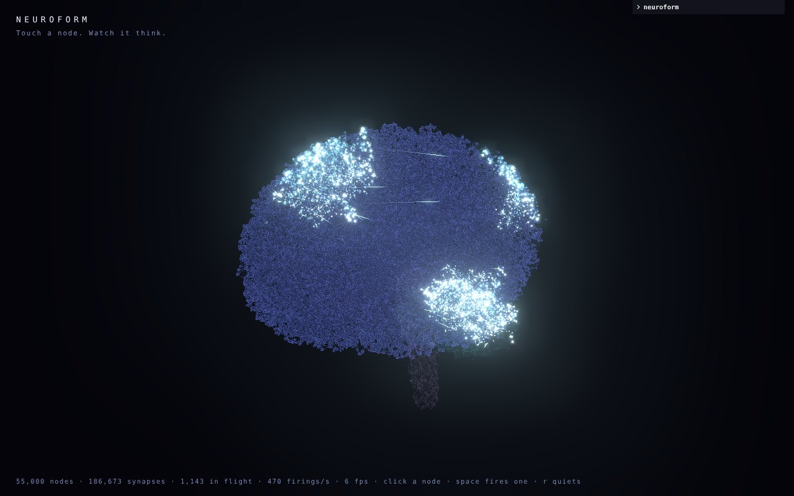
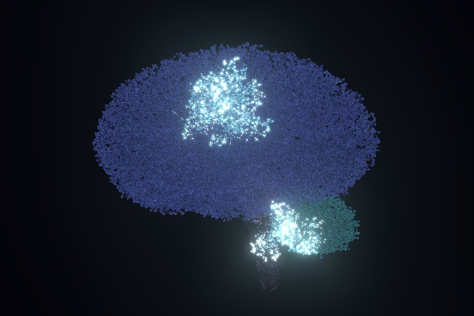
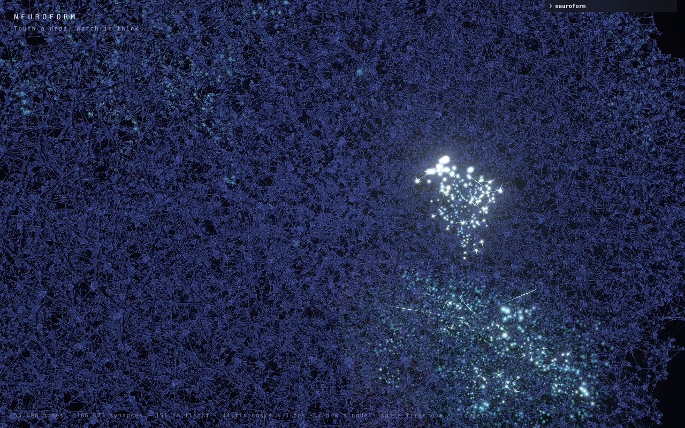

# Neuroform

A brain-shaped cloud of points, wired to each other by synapses. Touch a node
and it fires: the signal runs down its connections at a finite speed, charges
whatever it reaches, and whatever crosses threshold fires in turn. What you see
is a wave of activation sweeping out through the tissue and fading.

**Live:** https://skitionek.github.io/Neuroform/



<p>
  
  
</p>

```
npm install
npm run dev
```

### Publishing

`.github/workflows/pages.yml` builds every push and deploys the default
branch to GitHub Pages. Turn it on once under the repository's
Settings → Pages → Source: **GitHub Actions**. The build uses relative asset
paths, so it works under any repository name or a custom domain.

Click a node to fire it. Drag to orbit, scroll to zoom. `space` fires a random
node, `r` quiets the network. The panel in the corner opens with the structure,
signal and look controls.

## What's going on

**The shape** (`src/brain/shape.ts`) is an approximate signed distance field —
a cerebrum ellipsoid with a narrowed frontal pole, temporal lobes smooth-unioned
on, a flat base, a midline fissure subtracted from the top, a folia-striped
cerebellum and a brain stem. Ridged noise added to the distance carves the gyri,
which is what makes a cloud of dots read as cortex rather than as a lumpy egg.
Points are rejection-sampled through the whole volume of the brain, so the
mass is solid rather than a hollow skin. Lower `fill` to pull them back
towards a rind just under the folded surface.

**The wiring** (`src/graph/build.ts`) gives every node a random number of
synapses and spends them on its nearest neighbours, preferring close ones but
skipping some — strict nearest-neighbour wiring makes
a wave front that advances as a clean sphere, and a little disorder makes it
ragged. A few long-range tracts cross the midline so activation can jump
hemispheres.

**The activation** (`src/sim/network.ts`) is an excitable medium. A firing node
launches a pulse down each synapse that holds; pulses travel at a finite speed,
so long wires arrive late. Arriving signal deposits charge scaled by the
synapse's strength, charge leaks away continuously, and a node that crosses
threshold fires and then sits refractory. Signal amplitude decays with the
*distance travelled* rather than per hop, so how far a wave spreads stays the
same whether the cloud has 5,000 points or 100,000.

**The cells** (`src/graph/neurons.ts`, `src/render/membranes.ts`) give the
nodes and their connections a soft, merging, organic look, after the CSS
"gooey" recipe (blur, then threshold alpha with `feColorMatrix ... 18 -6`).
Each node is a small wobbling blob and its links are soft tubes, thick where
they meet a blob; both are drawn as density, and a full-screen pass
thresholds it with the same ramp and lights a membrane rim. The merge is
depth-aware: a pre-pass records the depth of each blob's solid core and the
density is depth-tested against it with a small slack, so only blobs that
are close in 3D fuse, not ones that merely overlap on screen. Cells are drawn
on the half of the brain facing the camera, and light up when their node
fires. `cellDensity` below 1 makes only a share of the nodes into cells
(larger `cellSize` then reads as sparse neurons with long neurites).

**The rendering** is three draw calls: the point cloud; every synapse, as a
very dim line (long-range tracts tinted violet in the same draw); and every
pulse in flight, drawn as a comet running from the firing node toward its
neighbour. Synapses and pulses pull their endpoints from node textures by
`gl_VertexID`, so each one knows both of its ends.

## Performance

The network is generated on a Web Worker, so the current one keeps animating
while its replacement is built. 100,000 nodes and 340,000 synapses build in
about 2 seconds off the main thread; swapping them in costs ~70ms on it.

- **Sampling** brackets each field with cheap analytic bounds and only
  evaluates the noise where those bounds can't decide, which is under 8% of
  candidates. The small regions are drawn from their own tight boxes rather
  than the whole brain's, and normals come from the smooth surface rather than
  the noisy one.
- **Wiring** finds each node's exact k nearest neighbours in an implicit k-d
  tree (kdbush's layout, in 3D), so its cost depends on k rather than on how
  many points sit within reach, and stays flat on clustered data or data with
  stray outliers, where a grid goes quadratic. Same graph as an exhaustive
  search.
- **The simulation is event-driven.** Pulses sit in a heap keyed by arrival
  time; charge leaks lazily when a pulse lands; glow is stored as (peak, start
  time) and decayed in the vertex shader. A frame costs time proportional to
  what happens in it, and a resting network costs nothing however large.
- **Uploads are sparse.** Only the nodes and pulses that changed are sent to
  the GPU each frame, and a pulse's position along its wire is computed from
  the shader clock, so its data is written once. Synapses are an index buffer
  over the node attributes rather than a copy of them.
- **Picking** marches the pointer ray through a grid instead of testing every
  point.
- **Lines are not instanced.** Instancing a two-vertex line hundreds of
  thousands of times wastes most of each vertex batch (it was 18x slower in
  testing); a plain draw that works out its synapse from `gl_VertexID` is not.
- **Rendering is paced.** While a wave runs or the camera is being handled,
  every frame is drawn; at rest only slow motion remains, so frames are drawn
  at `restFps` (20 by default) and the rest are skipped, about two thirds of
  them. The orbit is driven by elapsed time, so it turns at the same speed at
  any frame rate or refresh rate.
- **Cells are drawn only as finely as they need.** Their density buffer is a
  smooth field thresholded after upsampling, so it drops below full
  resolution (to half at most) as long as a typical cell stays 2.5 pixels
  across in it. Cell glow is read straight from a GPU copy of the simulation's
  (peak, start) per node, updated a texture row at a time when nodes fire,
  rather than recomputed for every cell on the CPU each frame. Bloom works
  from CSS pixels, a quarter of the cost on a high-density screen.

### Measuring the GPU

`?gpu=1` times each render pass with WebGL timer queries and shows the result
under the readout (synapses, points and pulses separately, then bloom and
output). Where the browser or GPU lacks the timer extension, `?gpu=finish`
brackets each pass with `gl.finish()` instead: it stalls the pipeline, so the
totals are inflated, but it still ranks the passes. From a script:
`neuroform.gpuTimings()` and `neuroform.resetGpuTimings()`.

## Driving it from data

The generator is one implementation of `GraphSource` (`src/graph/types.ts`); a
dataset is another. Load one with `?dataset=your-graph.json`:

```json
{
  "nodes": [[x, y, z], ...],
  "edges": [[a, b], ...],
  "regions": [0, 1, ...],
  "depth": [0.0, ...]
}
```

`nodes` and `edges` may also be flat arrays. `regions` (colour grouping) and
`depth` (0 at the surface, 1 deep) are optional. Positions are centred and
scaled on load, so any units work. `public/sample-graph.json` is a worked
example: `?dataset=sample-graph.json`.

For large data, any field can instead be a binary typed array in plotly's
format, which is what plotly.py writes for numpy arrays:

```json
{ "nodes": { "dtype": "f4", "bdata": "<base64>", "shape": "100000,3" },
  "edges": { "dtype": "u4", "bdata": "<base64>", "shape": "340000,2" } }
```

It loads about 40x faster than plain numbers (100k nodes and 340k synapses in
~12 ms instead of ~490 ms) and is smaller. Plain and binary fields can be mixed.
`public/sample-graph.typed.json` is the same sample in this form.

Everything downstream reads the same `NetworkGraph`, so nothing in the
simulation or the renderer changes when the network starts coming from a
dataset instead of from noise.

## Knobs

Any setting is also a URL parameter, so a particular brain is a link:
`?nodes=60000&foldScale=9&range=3&bloom=1.2&seed=42`.

Settings are tuned at 55,000 nodes and normalised for the actual count
(`src/core/scale.ts`), so changing `nodes` makes the brain finer or coarser
without changing how it behaves or how bright it looks. With node spacing
`s = ∛(55000 / nodes)`, reach, point size, comet length and cell size scale
by `s`, the synapse veil by `s²`, and pulse glow by `s`. Speed, range and the
timings are already per unit of distance or time, so they are left alone.
The pulse pool grows with the network so big waves are not clipped.

| | |
|---|---|
| `nodes`, `seed` | how many points, and which brain |
| `shape` | `classic` (egg with noise folds), `anatomical` (lobes, fissures, named sulci) or `scan` (a real brain, from the MNI ICBM152 template) |
| `foldDepth`, `foldScale`, `shell` | how deep and how fine the gyri (procedural shapes only), how thick the surface layer |
| `fill` | `1` fills the volume evenly, `0` crowds nodes into the surface layer |
| `minDegree`, `maxDegree`, `radius` | synapses per node and how far they reach |
| `speed`, `range` | how fast signal travels and how far it gets before fading |
| `threshold`, `gain`, `decay`, `refractory` | what it takes to make a node fire |
| `reliability` | how often a synapse actually transmits |
| `glow`, `shimmer`, `spontaneous` | afterglow, idle sparkle, how often the network fires on its own |
| `pointSize`, `edgeOpacity`, `pulseIntensity`, `cometLength`, `bloom` | the look |
| `depth`, `fov` | how much the far side darkens, waves included (`0` off); field of view, changed as a dolly zoom so the brain keeps its size |
| `theme`, `background`, `transparent` | `dark` (light on a dark ground) or `light` (the same activity as ink on paper); the background colour, which each theme sets to its own when picked (`?background=ffffff`); `1` renders with an alpha channel and no background, for embedding over another page |
| `restFps` | frame rate while nothing fast is happening; `0` draws every frame |
| `neurons`, `cellDensity`, `cellSize`, `cellZoom` | cells on or off (`0`), share of nodes drawn as cells, blob radius, how far cells follow the zoom (`0` fixed in the brain, `1` fixed on screen) |
| `merge` | zoomed out, cells merge into one uniform brain shape and dots and synapses fade into it; zoomed in, it resolves into neurons (`0` off) |
| `cellRes` | pin the cells' buffer resolution (`1` full, `0.5` half); by default it fits the cell size |
| `gpu` | `1` for GPU pass timings, `finish` for the stalling fallback |

`?capture=1` keeps the drawing buffer readable for screenshots.
`window.neuroform` exposes the graph, the simulation and the layers for driving
the piece from a script: `stimulate(node?)`, `reset()`,
`look({ bloom: 1 })` and `rebuild({ nodes: 60000, seed: 3 })`.

## Credits

The `scan` brain shape is derived from the MNI ICBM152 2009a nonlinear
symmetric template (Fonov et al., NeuroImage 2009), copyright (C) 1993-2004
Louis Collins, McConnell Brain Imaging Centre, Montreal Neurological
Institute, McGill University; see `public/brain-mni152.LICENSE.txt`.
`scripts/build-brain-sdf.py` regenerates it.
